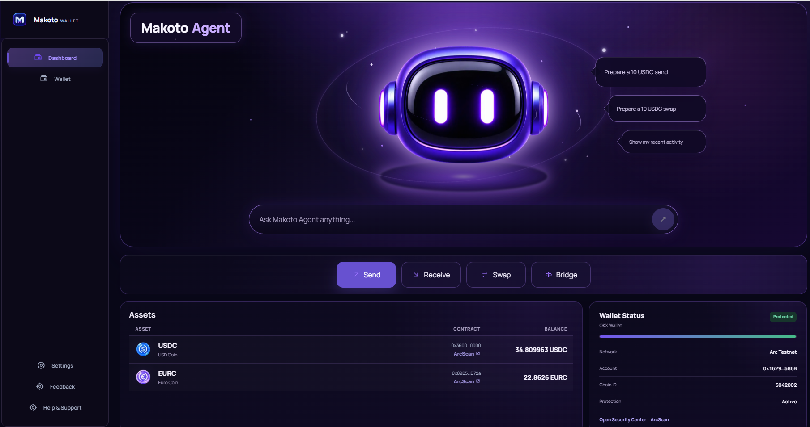
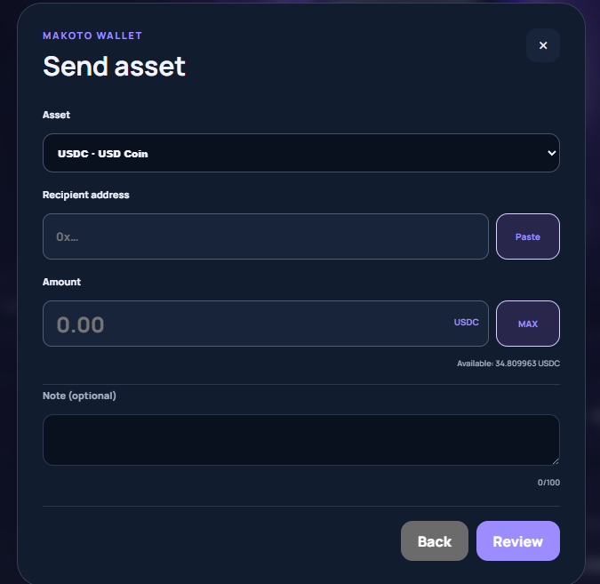
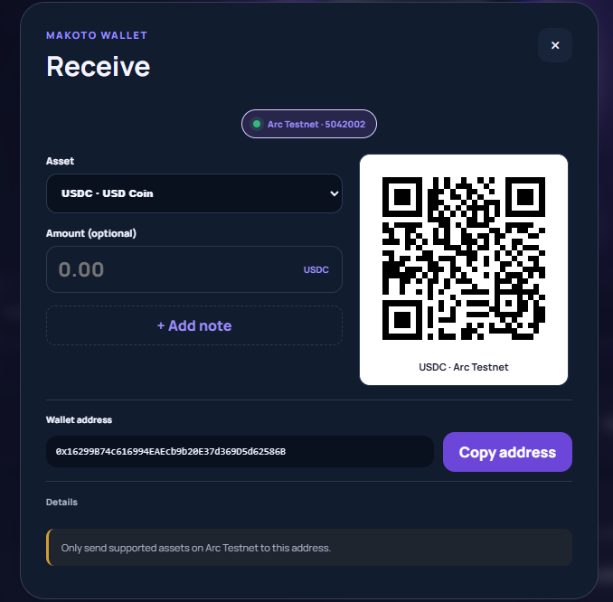
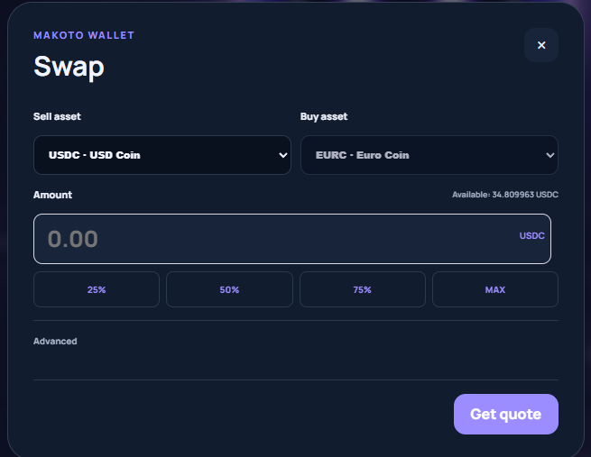
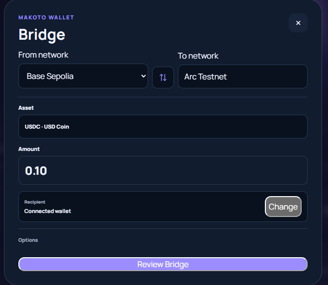

# Makoto Wallet

A non-custodial smart wallet for Arc, built around Makoto Agent.

Check balances, understand wallet activity, monitor network status, and prepare Send, Swap, and Bridge actions from one interface—while keeping final transaction approval in your hands.

| | |
| --- | --- |
| **Production** | [makotowallet.xyz](https://makotowallet.xyz) |
| **Network** | Arc Testnet |
| **Status** | Public Beta |



## What is Makoto Wallet?

Makoto Wallet brings wallet context, transaction preparation, and safety review into one responsive interface. It is designed for everyday Arc Testnet use with supported stablecoins while preserving a clear boundary: Makoto can help prepare an action, but only the connected wallet can approve and sign it.

The current experience includes a wallet-aware Agent dashboard, direct Send, Receive, Swap, and Bridge flows, wallet activity, network status, and Security settings. English and Vietnamese interfaces, Dark and Light modes, and desktop-to-mobile layouts are supported.

## Makoto Agent

Makoto Agent is a wallet-aware assistant, not an autonomous execution bot. It can:

- summarize supported wallet balances and recent activity;
- explain network and wallet status;
- prepare Send, Swap, Bridge, and supported wallet-action drafts;
- offer suggestions that adapt to available wallet context;
- hand prepared actions to the existing review flow.

Agent preparation never signs or submits a transaction. The user reviews the action and decides whether to continue in their wallet.

## Core Wallet Features

### Wallet

- Non-custodial wallet connection through the user's wallet provider
- Supported Arc Testnet USDC and EURC balances
- Wallet-scoped activity and confirmed transaction receipts
- Manual wallet approval for every blockchain write

### Send

- Compact recipient and amount preparation
- Transaction review and safety checks before wallet handoff
- Optional Arc Memo note support where applicable
- Receipt-backed confirmation state

### Receive

- QR code and wallet address
- Optional requested amount and note
- Compact details that are easy to share without exposing wallet secrets

### Swap

- Direct USDC ↔ EURC Swap flow
- Live quote, minimum received, and fee presentation
- Routing and slippage details available when needed
- Explicit approval and wallet confirmation boundaries

### Bridge

- Direct cross-chain Bridge flow using the implemented Circle CCTP integration
- Source, destination, expected receive, and compact fee summary
- Technical route details available on demand
- No automatic signing or submission

### Security

- Wallet and Arc Testnet status
- Connected-wallet and network information
- Privacy disclosures
- Appearance and language preferences
- Available under **Settings**, rather than as a standalone primary destination

## Wallet Actions

Every action stays inside a compact, purpose-built flow. Makoto prepares the details and safety review; the connected wallet remains responsible for final approval.

| Send | Receive |
| --- | --- |
|  |  |

| Swap | Bridge |
| --- | --- |
|  |  |

## Safety Model

- Makoto Wallet is non-custodial and does not store private keys or seed phrases.
- Makoto Agent does not automatically sign or submit transactions.
- Agent-prepared actions still require review and wallet confirmation.
- Transaction review and deterministic safety checks run before wallet handoff.
- The connected wallet remains the final signing authority.
- The current deployment is a Public Beta on Arc Testnet. Use testnet assets only.

This repository does not claim an independent professional security audit or certification.

## Architecture

```text
User
  ↓
Makoto Agent
  ↓
Wallet context and intent preparation
  ↓
Send / Swap / Bridge review
  ↓
User wallet
  ↓
Manual confirmation
```

Makoto Agent produces bounded, data-only preparation results. Existing wallet flows own validation, safety review, and the final wallet request.

## Technical Overview

### Frontend

- Next.js 16.3
- React 19 and TypeScript
- wagmi 3 and viem 2
- Reown AppKit
- TanStack Query 5

### Network and assets

| Item | Value |
| --- | --- |
| Network | Arc Testnet |
| Chain ID | `5042002` |
| Explorer | [testnet.arcscan.app](https://testnet.arcscan.app) |
| Gas token | USDC |
| Arc Testnet USDC | `0x3600000000000000000000000000000000000000` |
| Arc Testnet EURC | `0x89B50855Aa3bE2F677cD6303Cec089B5F319D72a` |
| Token decimals | `6` |

The repository also contains historical Solidity and Hardhat work that is separate from the current wallet presentation.

## Getting Started

Requirements: Node.js 20 or later and npm.

```bash
git clone https://github.com/congthuat/Makoto-Wallet.git
cd Makoto-Wallet/frontend
npm ci
cp .env.example .env.local
npm run dev
```

Open [http://localhost:3000](http://localhost:3000). On Windows PowerShell, replace the copy command with:

```powershell
Copy-Item .env.example .env.local
```

Only documented public `NEXT_PUBLIC_*` configuration belongs in the frontend environment file. Never place a private key, seed phrase, or wallet signing secret in `.env.local`, source code, GitHub, or deployment configuration.

## Testing and Development

Run frontend validation from `frontend/`:

```bash
npm test
npm run typecheck
npm run lint
npm run build
```

Run contract validation from the repository root when working on contracts:

```bash
npm run compile
npm test
```

These are project validation commands, not evidence of an independent security audit.

## Public Beta

Makoto Wallet is currently in **Public Beta on Arc Testnet**. Use testnet assets only. The application is intended for testing and demonstration and is not represented as mainnet-ready financial software.

## Additional Documentation

- [Architecture and operational boundaries](docs/ARC-NATIVE-ARCHITECTURE.md)
- [Manual QA guidance](docs/PHASE-10-11-QA.md)
- [License](LICENSE)
