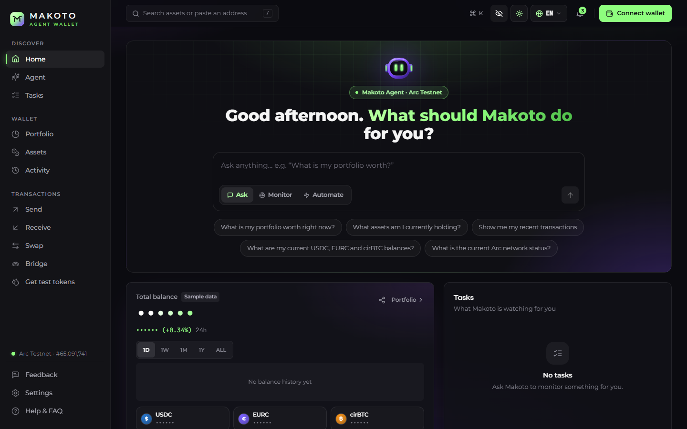
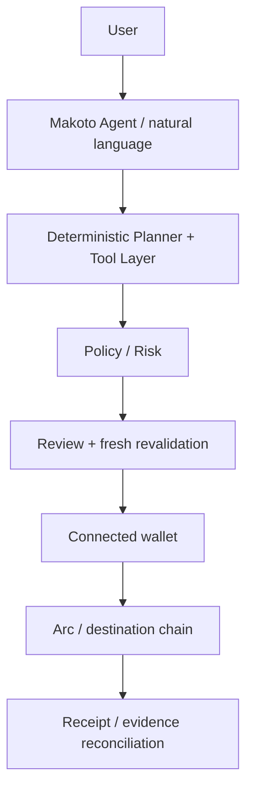

# Makoto Wallet

Makoto Wallet is a non-custodial agent wallet for Arc Testnet that combines natural-language wallet interaction with deterministic policy, review, and user-controlled transaction signing.

**Live app:** [makotowallet.xyz](https://makotowallet.xyz)

**Network:** Arc Testnet — Chain ID `5042002`

<p align="center">
  <a href="https://makotowallet.xyz">
    
  </a>
</p>

<p align="center">
  <sub>Makoto Wallet production interface · Arc Testnet</sub>
</p>

## What is Makoto?

Makoto Agent is the conversational interface to the wallet. It answers questions from observed wallet, portfolio, and network data, and helps prepare Send, Swap, and Bridge requests. The deterministic planner, tool layer, and Policy/Risk checks remain authoritative for financial actions and transaction state.

Makoto is non-custodial: the connected wallet remains the final signer. The Agent never receives or stores private keys or seed phrases, and cannot authorize a transaction on the user's behalf.

## What works today

| Area | Current capability |
| --- | --- |
| Agent | Natural-language chat; deterministic wallet, portfolio, and network reads; Send / Swap / Bridge planning and handoff. The LLM is used for conversation and explanation only. |
| Wallet connection | EIP-6963 discovery and compatible injected providers, including detected OKX Wallet, MetaMask, Rabby, and other discovered wallets; public-address watch-only mode. |
| Portfolio | Arc Testnet USDC, EURC, and cirBTC balances; CoinGecko pricing; server-authoritative recorded balance history with 1D / 1W / 1M / 1Y / ALL ranges. History starts with real observations, with no fake or backfilled points. |
| Send | Reviewed connected-wallet ERC-20 transfers of USDC, EURC, and cirBTC. |
| Swap | Connected Xylo USDC ↔ EURC flow, with exact finite approval and separate reviews where approval is required. |
| Bridge | Official Circle CCTP v2 integration for USDC from Arc Testnet to Base Sepolia, with explicit review and user wallet signing. Live destination completion has not been verified at the current checkpoint. |
| Tasks | Balance threshold monitoring and daily scheduled summaries through a persistent backend scheduler. Financial automation is `PREPARE_ONLY`; there is no unattended wallet signing. |
| Receive | Address and QR receive flow. |
| Activity | Evidence-based transaction and activity states, with pending, unknown, and confirmed outcomes kept distinct. |
| Analytics | Read-only Arc network and onchain intelligence, with verified source labels and bounded transfer/holder samples. |
| Localization / UI | Five-language UI: English, Vietnamese, Japanese, Korean, and Chinese; light/dark themes; responsive desktop and mobile layouts. |
| Get test tokens | Arc Testnet faucet surface linking to Circle's external faucet. Opening the faucet does not itself request or deliver tokens. |

## Agent safety model


```mermaid
flowchart TD
    U[User] --> A[Makoto Agent / natural language]
    A --> T[Deterministic Planner + Tool Layer]
    T --> P[Policy / Risk]
    P --> R[Review + fresh revalidation]
    R --> W[Connected wallet]
    W --> C[Arc / destination chain]
    C --> E[Receipt / evidence reconciliation]
```

The LLM cannot:

- Sign transactions or access private keys.
- Create authoritative balances or fabricate quotes.
- Bypass Policy/Risk or user review.
- Mark transactions confirmed.

## Transaction model

`PREPARE != EXECUTE`. Preparing a request is separate from handing it to the wallet. A wallet request is not confirmation; writes require explicit user wallet confirmation, followed by receipt and matching transaction evidence.

`USER_REJECTED`, `UNKNOWN`, `PENDING`, and `CONFIRMED` are distinct states. Rejection does not imply submission, a missing result does not imply failure or success, and a source-chain confirmation does not establish bridge destination completion.

## Circle CCTP v2

The current write scope is **USDC only: Arc Testnet (`5042002`) → Base Sepolia (`84532`)**. The integration uses the repository's pinned official Circle adapter and CCTP provider packages.

The flow obtains a quote, prepares an exact finite approval when needed, simulates the prepared call, and presents approval and burn reviews separately. Fresh account, chain, quote, request, and Policy/Risk checks precede wallet handoff. A successful source receipt and matching CCTP evidence establish the source step; destination completion requires a confirmed destination receipt and matching USDC transfer evidence. Attestation or a forwarder hash alone is insufficient.

Implementation tests and read-only live quote verification exist. The current verification checkpoint does **not** claim a real live burn plus destination transaction has completed. EURC/cirBTC CCTP writes and Universal Bridge execution remain unavailable. See [the integration scope and evidence](docs/CIRCLE_CCTP_V2_INTEGRATION.md).

## Portfolio history

History is persisted in backend SQLite. The server reads Arc balances and CoinGecko prices itself; callers cannot submit arbitrary historical totals, balances, prices, or timestamps. Captures require complete observations and fresh prices. Provider failures produce unavailable or stale pricing states, and do not create synthetic history points.

Production history access requires explicit SIWE wallet verification through **Verify wallet**. Signing this ownership message costs no gas and is not a blockchain transaction. Connecting a wallet alone does not request that signature.

Captures are real observations collected during active visible app use, at least five minutes apart. At least two observations in the selected range are needed for a chart. Recording begins when authorized observations are available, with no historical reconstruction or backfill; ALL covers retained recorded history. See [portfolio history](docs/PORTFOLIO_HISTORY.md).

## Tasks

The persistent backend scheduler can keep running after the browser closes, provided the backend and its storage remain available. Balance monitors and daily scheduled summaries are owner scoped; task management requires verified wallet ownership.

Financial actions remain `PREPARE_ONLY`. The scheduler has no wallet signer and cannot submit unattended Send, Swap, Bridge, or approval transactions. Its SQLite claim model coordinates processes on **one host sharing the same SQLite file**; it is not a multi-host distributed lock. See [task execution claims](docs/TASK_EXECUTION_CLAIMS.md).

## Architecture

| Layer | Implementation |
| --- | --- |
| Frontend | Vite + React 19 + TypeScript + Tailwind CSS |
| Backend | Node.js + Express |
| Persistence | SQLite / WAL |
| Wallet | EIP-1193 / EIP-6963 |
| Blockchain | Arc Testnet |
| Bridge | Circle CCTP v2 |
| Pricing | CoinGecko |
| Agent | Backend-only Responses-compatible LLM provider + deterministic local tool/planner architecture |
| Deployment | Frontend on Vercel; backend on Railway; `/api/*` same-origin proxy |

## Repository structure

```text
frontend/               Wallet UI and connected-wallet integration
backend/                API, authentication, persistence, and scheduler
shared/                 Shared portfolio valuation
docs/                   Current documentation and engineering notes
validation-qa/          Recorded QA and verification evidence
brain-donor-reference/  Historical/reference material only
AGENTS.md               Repository working rules
```

## Run locally

Use **Node.js >=24**. From the repository root, install the backend and frontend dependencies:

```sh
npm install --prefix backend
npm install --prefix frontend
```

Copy `backend/.env.example` to `backend/.env` and `frontend/.env.example` to `frontend/.env` using your platform's file tools. Fill in your own server-only credentials. The local runner requires the backend's `SURF_API_KEY`; portfolio pricing requires CoinGecko configuration. The conversational LLM provider is optional. Keep credentials in the backend environment.

Start both services:

```sh
npm run dev
```

- Frontend: [http://localhost:5173](http://localhost:5173)
- Backend health: [http://localhost:3001/api/health](http://localhost:3001/api/health)

Ports are strict: the runner requires 5173 and 3001 and exits if either is unavailable. Ctrl+C stops both services.

For a production build, the frontend must have a nonempty `BACKEND_PORT` and a defined `BASE_PATH` (which may be empty), supplied through `frontend/.env` or the build environment:

```sh
npm run build --prefix frontend
```

This produces `frontend/dist/client` and `frontend/dist/server`. A hosted frontend also needs the same-origin `/api/*` proxy to the backend; the repository's Vercel configuration supplies that proxy.

## Documentation

- [Project state](docs/PROJECT_STATE.md)
- [LLM Agent integration](docs/LLM_AGENT_INTEGRATION.md)
- [Home Agent and wallet UX](docs/AGENT_HOME_UX.md)
- [Portfolio history](docs/PORTFOLIO_HISTORY.md)
- [Circle CCTP v2 integration](docs/CIRCLE_CCTP_V2_INTEGRATION.md)
- [Task execution claims](docs/TASK_EXECUTION_CLAIMS.md)
- [Pricing provider](docs/PRICING_PROVIDER.md)
- [Analytics product scope](docs/ANALYTICS_PRODUCT_SCOPE.md)
- [Full documentation index](docs/README.md)
- [2026-10-02 release candidate notes](docs/releases/2026-10-02-production-preview.md)

## Current limitations

- Arc Testnet only for wallet operations; Base Sepolia is the supported CCTP destination.
- Testnet assets have no intended real-world monetary value.
- No independent professional security audit is claimed; Makoto is not mainnet-ready financial software.
- Circle CCTP's current write scope is USDC from Arc Testnet to Base Sepolia. No real live CCTP destination completion is claimed by current evidence.
- Portfolio history starts when actual recording begins, with no backfill. Fresh pricing and verified production history access are required for new captures.
- The scheduler's SQLite coordination is not a multi-host distributed lock. Scheduling requires a running backend and persistent storage.

## Security

See [SECURITY.md](SECURITY.md) for the security boundary and private vulnerability reporting guidance.
