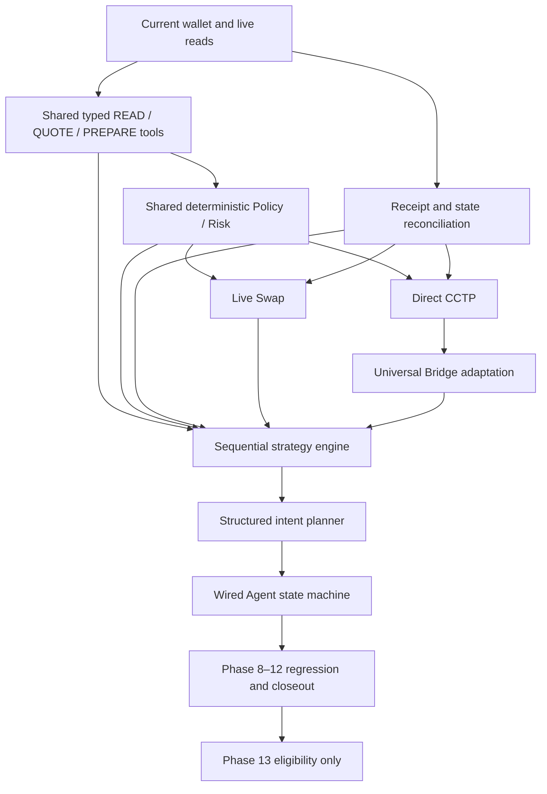

# Legacy phase migration audit — 2026-09-29

## 1. Audit identity

**Scope:** read-only comparison of canonical Makotowallet.xyz with locally preserved donor code and historical documents. No transaction, runtime migration, commit, push, or deployment is part of this audit. Architecture phases 8–12 below are the approved roadmap in `ROADMAP.md`. The donor document `brain-donor-reference/docs/PHASE-10-11-QA.md` uses an older product-phase numbering; its “10.x” does not certify any architecture Phase 10 subphase here.

**Classification:** A fully active in current runtime; B partially active; C present in current source but not wired; D donor/reference only; E missing in inspected local source; F donor counterpart superseded by a stronger current implementation; G blocked by external dependency. The code is a migration assessment, not a claim about whether an old project once completed a feature. A current page or type alone never proves a live workflow.

## 2. Source evidence inspected

- Canonical architecture/runtime: `frontend/src/App.tsx`, `frontend/src/pages/{Agent,Send,SwapBridge,AssetsActivity,Faucet,Tasks,Settings}.tsx`, `frontend/src/brain/{types,parser,orchestration,policy,handoff,lifecycle,adapter}.ts`, `frontend/src/lib/{wallet,store,sendExecution,activity,scenarios,api}.ts(x)`, `backend/{server.js,routes/arc.js,routes/prices.js,routes/sentiment.js}`.
- Current tests and observations: `frontend/src/{brain/brain.test.ts,lib/sendExecution.test.ts,lib/activity.test.ts,lib/faucet.test.ts}`, `docs/SEND_RUNTIME_AUDIT.md`, `docs/ACTIVITY_FAUCET_AUDIT.md`. The prior user-authorized real Send is documented there; it was not repeated.
- Provenance: `BRAIN_TRANSPLANT.md`, `BRAIN_TRANSPLANT_MANIFEST.json`, `BRAIN_TRANSPLANT_PRESERVATION_AUDIT.json`, `TRANSPLANT_PROVENANCE.json`.
- Donor code: `brain-donor-reference/frontend/lib/agent/`, `lib/{transactionSafety,transactionOrchestrator,transactionReceipt,arcTransactionLifecycle,swap,swapPlanning,cctp,onchainActivity,walletActivity}.ts`, `lib/circle/`, `lib/indexer/`, and preserved donor tests. Historical context: `brain-donor-reference/docs/{ARC-NATIVE-ARCHITECTURE,PHASE-10-11-QA,PUBLIC_BETA_FINAL_AUDIT,05-architecture,06-security}.md`. Donor files may import files outside the preserved reference; this audit does not treat them as executable current modules.

## 3. Current canonical architecture

Vite/React pages use `lib/store.tsx` for demo/watch/connected wallet state. An Express backend serves Arc explorer/RPC wallet, network, and feed data through `routes/arc.js`, plus Surf market routes. Injected EIP-1193 is the user wallet (`lib/wallet.ts`). Live Send alone constructs a bounded ERC-20 request and asks that wallet to submit (`lib/sendExecution.ts`, `pages/Send.tsx`). The brain parses and prepares locally, then hands data to product pages (`brain/*`, `pages/Agent.tsx`). Swap/Bridge remain previews (`pages/SwapBridge.tsx`). Current UI design and stack are authoritative; donor Next/Wagmi/Circle code must be adapted as logic, not copied as UI.

## 4. Phase 8 — Makoto Tool Layer matrix

| Item | Status | Current and donor evidence; migration gap |
|---|---|
| 8A current-system audit | **B** | Current Send/Activity/Faucet audits exist in `docs/`; this document maps remaining code. No protocol runtime closeout yet. |
| 8B read tools | **B** | Current `lib/store.tsx`, `lib/wallet.ts`, `routes/arc.js` read account, chain, balances, verified assets, Activity, and network. `lib/sendExecution.ts` reads token metadata, gas, balance, and receipts for Send. No shared typed Agent READ registry, allowance reader, or general receipt reader. Donor `agent/tools.ts`, `agent/planning.ts`, `indexer/rpcFallback.ts` are reference. |
| 8C quote tools | **B** | Current Send gas/fee planning in `lib/sendExecution.ts`; Swap uses reference prices only and Bridge displays previews in `pages/SwapBridge.tsx`. Donor `swap.ts`, `swapPlanning.ts`, `circle/bridgePlanning.ts`, `circle/bridge.ts` model quote freshness, fees, route and output. No current live swap/bridge quote, minimum receive or expiry evidence. |
| 8D prepare/write bounded unsigned requests | **B** | Send returns bounded `PreparedSend.request` and revalidates it (`lib/sendExecution.ts`). Brain handoff is data only (`brain/handoff.ts`). Approval, Swap, CCTP burn, Gateway/bridge unsigned adapters absent. Donor `transactionOrchestrator.ts`, `swap.ts`, `cctp.ts`, `circle/*` are candidates, not wired. |
| 8E schemas + validation | **B** | `brain/types.ts`, `brain/orchestration.ts`, `lib/sendExecution.ts` type some inputs/results; Send rejects malformed amount/address and missing reads. No cross-protocol typed error, partial/unavailable, quote, request schema. Donor `agent/tools.ts`, `agent/actions/validation.ts`, `swapPlanning.ts` have richer categories. |
| 8F agent integration | **B** | `pages/Agent.tsx` calls `brain/adapter.ts`, `policy.ts`, `handoff.ts`; pages consume handoffs. Agent does not call a shared read/quote/prepare tool registry. Donor `agent/tools.ts` is reference. |
| 8G regression + closeout | **E** | Current `brain/brain.test.ts`, `lib/sendExecution.test.ts` cover foundation and Send; no Phase 8 end-to-end tool matrix or live protocol closeout. |

READ coverage detail: wallet/account and chain (`wallet.ts`, `store.tsx`) **A** for current connected UI; balances/assets/Activity/network (`routes/arc.js`, `store.tsx`) **A** for current UI with provider availability caveat; Send receipts/fees/token metadata (`sendExecution.ts`) **A** for Send only; allowances **D/E** (donor `swapPlanning.ts`, no current allowance reader). QUOTE: Send fee **A** for Send; live Swap/Bridge route, slippage/minimum receive and protocol expiry **D** (donor `swap.ts`, `circle/bridge*.ts`). PREPARE: Send **A**; approval/Swap/CCTP/Bridge **D** as donor logic and **E** as current runtime. The whole subphase remains B where a narrow active slice exists.

## 5. Phase 9 — Policy & Risk Engine matrix

| Item | Status | Current and donor evidence; migration gap |
|---|---|---|
| 9A threat model + policy inventory | **B** | `docs/SEND_RUNTIME_AUDIT.md` records Send hazards; donor `docs/06-security.md`, `lib/transactionSafety.ts` cover broader targets. No current cross-protocol threat inventory signed off. |
| 9B core deterministic engine | **B** | `brain/policy.ts` deterministically assesses preparation and `sendExecution.ts` enforces live Send checks. They are separate and no shared live protocol gate exists. Donor `transactionSafety.ts` is reference. |
| 9C chain/contract/token/approval/slippage controls | **B** | Send checks injected account/Arc chain, verified token metadata/allowlist, recipient structure/self/contract, balances and fee (`sendExecution.ts`). Brain checks simpler parameters (`brain/policy.ts`). Finite approval, spender/selector, live slippage/minimum receive are donor only (`transactionSafety.ts`, `swap.ts`). |
| 9D simulation + expiry + revalidation | **B** | Send uses `eth_estimateGas`, 60-second expiry and exact reprepare/request equality (`sendExecution.ts`, `pages/Send.tsx`); estimate is not a general protocol simulation. Brain review expires/revalidates fields (`brain/policy.ts`). Swap/Bridge do not have a live simulation gate. Donor `transactionOrchestrator.ts` models shared request snapshots. |
| 9E block/warn/review UX contract | **B** | Brain check statuses and Send review/block UI (`brain/policy.ts`, `pages/Send.tsx`); preview protocol pages do not have a real pre-sign review (`pages/SwapBridge.tsx`). |
| 9F adversarial + failure-path tests | **B** | `brain/brain.test.ts`, `lib/sendExecution.test.ts` cover account/chain/review/receipt/rejection paths. No cross-protocol allowance/slippage/CCTP failure suite. Donor `frontend/tests/` offers cases, not current PASS evidence. |
| 9G robustness audit + closeout | **E** | Current Send audit is a component audit, not shared Phase 9 closeout; no live Swap/Bridge policy path. |

**Reusable current Send protections:** fresh EIP-1193 account and chain, verified token code/symbol/decimals, EOA recipient restriction, exact integer amount, balance and USDC fee affordability, gas bound, 60-second request expiry, exact request comparison, duplicate guard, rejection classification, receipt and Transfer evidence (`lib/sendExecution.ts`). Extract only after preserving Send behavior. `brain/policy.ts` uses a small non-cryptographic mutation fingerprint for preparation, not a transaction signing or exact calldata fingerprint; donor `transactionOrchestrator.ts` has an exact normalized request model. Neither preview policy result is transaction approval.

## 6. Phase 10 — Sequential Strategy Engine matrix

| Item | Status | Current and donor evidence; migration gap |
|---|---|---|
| 10A strategy/step model | **E** | `brain/types.ts` defines one preparation and a transaction lifecycle, not a persisted multi-step strategy. Donor `circle/bridge.ts` models protocol stages, but no general strategy engine is preserved. |
| 10B single-step execution | **B** | Live Send one-step wallet submission (`lib/sendExecution.ts`, `pages/Send.tsx`). Other actions remain preview. |
| 10C receipt verification | **B** | Send checks receipt hash/block/status and matching token Transfer (`lib/sendExecution.ts`). Donor `transactionReceipt.ts` verifies broader activity; no shared multi-protocol receipt gate. |
| 10D state re-read/requote/revalidation after receipt | **B** | `lib/store.tsx` reconciles Send records and refetches wallet data; Send revalidation is pre-request. No strategy-directed post-receipt requote/allowance/balance gate. Donor `swapPlanning.ts`, `circle/bridgePlanning.ts` have candidate planning logic. |
| 10E controlled multi-step continuation | **D** | No current approval→action engine. Donor `docs/ARC-NATIVE-ARCHITECTURE.md` explicitly separates approval and protocol reviews; `circle/bridge.ts` has stages. Preserved modules do not establish a general active current controller. |
| 10F interruption/rejection/expiry/retry/recovery | **B** | Send guard, rejection and UNKNOWN receipt timeout plus later reconciliation (`sendExecution.ts`, `store.tsx`). `brain/lifecycle.ts` is unwired. No cross-step resume or safe recovery. Donor `arcTransactionLifecycle.ts` models more statuses but its timeout `dropped` is not sufficient proof of safe resubmission. |
| 10G end-to-end regression + closeout | **E** | Send tests exist; no approval→action or bridge sequence regression in current runtime. |

Current Send is the strongest reusable single-step and receipt foundation. Never equate a wallet hash with confirmation, nor auto-open a second wallet request after an approval receipt.

## 7. Phase 11 — Intent Planner matrix

| Item | Status | Current and donor evidence; migration gap |
|---|---|---|
| 11A intent schema | **B** | `brain/types.ts` defines read and prepare intents for Send/Swap/Bridge. Donor `agent/types.ts` includes wider read, planning, Vault, and intelligence intents. No current strategy intent. |
| 11B classify information/action/strategy | **B** | `brain/parser.ts`, `brain/orchestration.ts` classify local information/preparation/clarification; no strategy classification. Donor `agent/parser.ts`, `agent/orchestration.ts` are broader. |
| 11C structured plan generation | **D** | Current `pages/Agent.tsx` creates a fixed UI flow, `lib/scenarios.ts` has sample fallback. Donor `agent/planning.ts`, `agent/tools.ts` produce structured planning results; neither is a current multi-step plan. |
| 11D parameter resolution + validation | **B** | Current parser and missing-field/blocker routing (`brain/parser.ts`, `brain/orchestration.ts`), manual review fields in `pages/Agent.tsx`. Donor `agent/actions/validation.ts` adds strict draft constraints. Current Agent MAX is blocked by `brain/policy.ts`; manual Send safe MAX is separate (`lib/sendExecution.ts`). |
| 11E replanning after changed state/failure | **E** | Current review invalidates on changed fields/expiry (`brain/policy.ts`) and returns to edit; no structured replanning after receipt or failure. |
| 11F planner tests + closeout | **B** | `brain/brain.test.ts` tests parsing, routing, review and handoff, not a complete planner or changed-state plan. |

`pages/Agent.tsx` still falls back to `lib/scenarios.ts` for unmatched prompts. Those sample values are explicitly preview data, not inferred live intent. Donor `agent/planning.ts` supports send affordability, swap planning, bridge estimate, latest transaction and daily spending, but must be attached to current fresh tool evidence before migration.

## 8. Phase 12 — Agent State Machine matrix

| Item | Status | Current and donor evidence; migration gap |
|---|---|---|
| 12A state definitions | **B** | `brain/types.ts` defines prepared/awaiting-wallet/submitted/confirming/confirmed/failed/unknown. `lib/sendExecution.ts` defines richer Send statuses. No complete Agent action/strategy state. |
| 12B legal transitions + guards | **C** | `brain/lifecycle.ts` has a legal transition table, but no production imports outside its own module; `pages/Agent.tsx` uses a local numeric step. Send independently guards requests. |
| 12C session/state persistence boundaries | **B** | `brain/handoff.ts` uses expiring account-bound one-time `sessionStorage`; `lib/store.tsx` persists Send records locally. Agent conversation/flow is component state in `pages/Agent.tsx`. No durable strategy state. |
| 12D error/expired/rejected/failed states | **B** | Send distinguishes user rejection, pending, confirmed, failed, unknown (`lib/sendExecution.ts`, `pages/Send.tsx`). `brain/lifecycle.ts` lacks explicit rejected/expired. Agent review expiry returns to edit (`pages/Agent.tsx`). |
| 12E recovery/resume | **B** | `lib/store.tsx` rechecks pending/unknown Send receipt records for the connected account every 20 seconds. No Agent strategy resume or cross-chain recovery. |
| 12F UI wiring + truthful status surfaces | **B** | Send and Activity show evidence-based statuses (`pages/Send.tsx`, `pages/AssetsActivity.tsx`); Agent's own lifecycle module is unwired; Swap/Bridge are preview (`pages/Agent.tsx`, `pages/SwapBridge.tsx`). |
| 12G robustness audit + closeout | **E** | No integrated Agent state-machine regression/closeout. |

Donor `arcTransactionLifecycle.ts` has useful signature/submission/pending/final/RPC status ideas, but the current Send receipt plus Transfer verification and UNKNOWN/reconciliation must be kept. Donor `transactionReceipt.ts` and `indexer/*` can extend evidence coverage; neither may downgrade current Send truthfulness.

## 9. Product capability matrix

Status uses the same A–G legend. “Files” names likely migration touch points; dependencies and tests are recommendations, not approval to implement. Historical donor docs describe an older app; preserved donor module availability is stated separately.

| Capability | Current status | Donor status and migration required | Risk; dependencies | Likely files; required tests |
|---|---|---|---|---|
| Wallet connection | **A** injected wallet/live Arc account (`lib/wallet.ts`, `lib/store.tsx`) | Donor `lib/wallet.ts`; **no wholesale migration** | High if account/chain truth changes; dependency for all writes | `lib/wallet.ts`, `lib/store.tsx`; account/chain/disconnect/watch tests |
| Send | **A** live USDC/EURC/cirBTC (`pages/Send.tsx`, `lib/sendExecution.ts`) | Donor transaction safety/review may add shared controls; old Send execution **F** where current exact request/receipt is stronger | Highest transaction risk; preserve current path | `lib/sendExecution.ts`, `pages/Send.tsx`; existing tests plus wallet mutation, fee, receipt and duplicate cases |
| Receive | **A** address/QR receive surface (`App.tsx` receive modal, `lib/store.tsx`), on-chain incoming Activity via `routes/arc.js` | Donor wallet/activity reference; **no core migration** | Address/network labeling; wallet reads | `App.tsx`, `lib/wallet.ts`; address/copy/QR/network tests |
| Activity | **B** live Arc transfers plus Send local reconciliation (`routes/arc.js`, `lib/store.tsx`, `pages/AssetsActivity.tsx`) | Donor `indexer/*`, `onchainActivity.ts`, `transactionReceipt.ts`; **yes** for full protocol classification/fallback | Wrong classification or duplicate; receipts and protocols | backend Arc route, store, Activity; pagination, dedupe, partial/RPC failure, receipt tests |
| Faucet | **A** external Circle faucet link and three connected balances (`pages/Faucet.tsx`) | No donor logic needed for current scope; **no** | External availability; truthful link/balances | Faucet page; current faucet test plus failure state |
| Swap | **B** preview only (`pages/SwapBridge.tsx`) | Donor `swap.ts`, `swapPlanning.ts`, `swapFeeEnvelope.ts`, `safeSwapMax.ts`; **yes** | Quote, allowance, slippage, request and receipt; Tool/Policy/Strategy | Swap page, adapters, policy; quote expiry, finite approval, simulation, mutation, receipts |
| Direct CCTP | **E** no current direct execution (`pages/SwapBridge.tsx`) | Donor `cctp.ts`, `circle/bridgePlanning.ts`, historical `PHASE-10-11-QA.md`; **yes** | Burn versus mint, fee, attestation; Swap-independent shared gates | bridge adapter/page, policy, receipts; domains/fees, approval, burn and destination evidence |
| Universal Bridge | **B** preview route/speed UI (`pages/SwapBridge.tsx`) | Donor `circle/{appKit,bridge,bridgePlanning,browserAdapter,chains,types}.ts`; **yes** | Circle availability and route evidence, completion; shared CCTP safety | bridge adapter/page; quote expiry, speed/route, source/destination, provider failure |
| Unified Balance / Gateway | **E** no current page/route | Donor `circle/unifiedBalance.ts`, `circle/appKit.ts`, old `PHASE-10-11-QA.md`; **yes if product scope retained** | Allocation, fees, gateway indexing; Circle SDK/provider | new current adapter/page only after design; balance/fee freshness, allocation, deposit/spend receipts |
| Vault | **E** no current Vault product page | Donor `agent/types.ts`/handoff support and historical `05-architecture.md`, `06-security.md`, `PHASE-10-11-QA.md`; preserved Vault implementation is not present; **yes if retained** | Contract/state/privacy; verified contract and separate review | new current Vault adapter/UI after source recovery; ownership, lock, full withdrawal, receipts, privacy |
| Pay | **E** no current Pay page or preserved Pay implementation found | No sufficient donor runtime evidence; **scope/source decision needed** | Payment intent, recipient and receipts; wallet/Policy | only after requirements; intent, exact recipient, failure tests |
| Tasks | **B** local sample/proposal CRUD, no monitoring (`pages/Tasks.tsx`, `lib/store.tsx`, `lib/scenarios.ts`) | No preserved background scheduler; **yes** for real tasks | False alert/automation claim; data and notification service | task store/service/UI; trigger/no-trigger, persistence, timezone, failure tests |
| Agent | **B** local parse, policy review, handoff (`brain/*`, `pages/Agent.tsx`) | Donor `agent/*` wider tools/planning/intelligence; **yes** | Wrong intent, stale context, authority boundary; Phases 8–12 | brain, Agent page; EN/VI, missing fields, MAX, stale context, no signing |
| Contacts | **A** browser-local CRUD (`pages/Settings.tsx`, `lib/store.tsx`) | Historical donor local contacts; **no core migration** | Wrong recipient from stale contact; Send review | Settings/Send; malformed/duplicate/edit/review tests |
| App Lock / Security | **B** preview only (`pages/Settings.tsx`, `App.tsx`) | Historical `PUBLIC_BETA_FINAL_AUDIT.md` describes PBKDF2 local gate; preserved implementation absent; **yes** for real lock | Misrepresented protection, lock bypass; explicit security boundary | Settings/App/new lock service; PIN, cooldown, tabs, reload, reset tests |
| Notifications | **B** in-app toast/list and tx-alert setting (`lib/store.tsx`, `App.tsx`, `pages/Settings.tsx`), no task alert engine | Donor historical Activity/notification context only; **yes** for real alerts | False alerts or missed events; indexer/tasks | store/App/task service; receipt-grounded incoming and dedupe tests |
| Price/sentiment | **B** backend routes and price query (`routes/prices.js`, `routes/sentiment.js`, `lib/store.tsx`) | Surf provider dependency; **migration not primary**, verify degraded state | Provider/API outage; no fake market value | backend routes, store, Insights; malformed/unavailable/stale tests |
| Indexer/receipt reconciliation | **B** Arc explorer feed and Send receipt recheck (`routes/arc.js`, `lib/store.tsx`) | Donor `indexer/{normalize,filter,rpcFallback}.ts`, `onchainActivity.ts`, `transactionReceipt.ts`; **yes** | Duplicate/misclassified records, incomplete history; protocol receipts | backend/store/activity; pagination, RPC fallback, log matching, unknown recovery tests |

## 10. Active current capabilities

Current runtime evidence supports injected wallet connection, Arc account/chain and token reads, live bounded Send for three tokens, evidence-backed Send confirmation and later reconciliation, receive address surface, current Activity feed, Circle faucet referral, and browser-local contacts. Source: `lib/wallet.ts`, `lib/sendExecution.ts`, `lib/store.tsx`, `routes/arc.js`, `pages/{Send,AssetsActivity,Faucet,Settings}.tsx`; prior live Send observation is in `docs/SEND_RUNTIME_AUDIT.md`. “Active” applies to these slices, not a whole architecture phase.

## 11. Partial capabilities

Agent parse/policy/handoff, Activity classification/history depth, Swap/Bridge previews, Tasks, App Lock preview, notifications, price/sentiment availability, and broader receipt/indexer intelligence are partial. `brain/lifecycle.ts` is **C** (source present, UI unwired). `lib/scenarios.ts` sample fallback is explicitly a prototype; do not represent sample values as a live planner output. Sources are in sections 4–9.

## 12. Donor-only capabilities

Agent capability registry and richer planning (`donor/lib/agent/{tools,planning}.ts`); generalized transaction safety/request snapshots (`transactionSafety.ts`, `transactionOrchestrator.ts`); live swap calculation/quote freshness (`swap.ts`, `swapPlanning.ts`); direct CCTP and Circle bridge/Gateway adapters (`cctp.ts`, `circle/*`); indexer normalization/RPC fallback (`indexer/*`, `onchainActivity.ts`); richer receipt logic (`transactionReceipt.ts`). Historical documents describe Vault and App Lock, but their implementation is not preserved in this reference bundle. “Donor-only” means not imported by current runtime.

## 13. Missing capabilities

In inspected current runtime: a protocol-neutral typed Tool Layer, shared live Policy/Risk gate for Swap/Bridge, finite approvals and live protocol simulation, strategy/step execution and recovery, structured strategy planner/replanner, wired Agent state machine, live Swap, Direct CCTP, Universal Bridge completion, Gateway, Vault, Pay, real task monitoring, real App Lock, and full indexer. A missing current capability may have historical donor evidence; see section 9. Absence claims are scoped to inspected local source, not a claim about all possible old worktrees.

## 14. Superseded donor logic

For current **Send**, retain `lib/sendExecution.ts` exact live EIP-1193 request, verified token metadata, fee affordability, 60-second exact reprepare, duplicate guard, receipt hash/block/status and matching Transfer, and UNKNOWN recheck. Replacing it with donor `transactionOrchestrator.ts` or `arcTransactionLifecycle.ts` without these checks would regress truthfulness. The latter's timeout `dropped` state must not be treated as safe retry absent chain evidence. Donor `agent/actions/handoff.ts` has a similar one-time preparation role; current `brain/handoff.ts` is already wired, so only missing validations should be adapted. This is **F** for overlapping narrower logic, not a claim that donor shared architecture is obsolete.

## 15. External blockers

Surf DB is unavailable/unauthorized per checkpoint and `BRAIN_TRANSPLANT.md`; it does not block this audit. Surf market, Arc explorer/RPC, Circle faucet/SDK routes, and any future quote provider may independently be unavailable at runtime; surface unavailable/partial rather than successful data. Historical Vault/App Lock source and Pay requirements are **source/scope gaps**, not proven external service blockers. No external condition justifies marking a phase complete.

## 16. Migration dependency graph

Gateway/Vault/Pay/real Tasks are separate product scope decisions and should not be hidden inside Phase 8–12 closeout. Their integration must still obey the same tool, policy, receipt, and wallet boundaries.

## 17. Blast-radius analysis

| Change area | Affected surfaces and principal regression |
|---|---|
| Wallet/read extraction | `lib/wallet.ts`, `lib/store.tsx`, backend `routes/arc.js`, Send, Agent, Activity; account/chain mismatch or demo data misread as live. |
| Shared policy/request model | `brain/policy.ts`, `lib/sendExecution.ts`, Swap/Bridge adapters; Send exact request, fee, recipient, and 60-second review behavior could regress. Keep Send adapter compatibility tests. |
| Receipt/indexer | `lib/sendExecution.ts`, `lib/store.tsx`, `pages/AssetsActivity.tsx`, backend Arc route; hash-only success, duplicate entries, UNKNOWN→PENDING collapse, false cross-chain completion. |
| Swap/Bridge protocols | `pages/SwapBridge.tsx`, new adapters, Agent handoff; quote/allowance/fee mutation, unexpected wallet prompts, source burn shown as completed. |
| Planner/state machine | `brain/*`, `pages/Agent.tsx`, product pages; sample fallback mistaken for live plan, stale handoff, auto continuation or signing authority leak. |
| UI/security/product additions | `App.tsx`, Settings, Tasks, contacts and notifications; responsive/EN/VI/theme regressions, local privacy or misleading protection claims. |

## 18. Recommended migration order

This is an audit recommendation, **not authorization to implement**. First lock current Send/Activity invariants with evidence. Then (1) expose existing wallet/Arc reads through typed read contracts, (2) add shared read/quote/prepare Tool Layer with unavailable/partial states, (3) extract deterministic policy and exact request review while preserving Send, (4) generalize receipt/reconciliation, (5) implement and verify live Swap, (6) implement Direct CCTP with source/destination evidence, (7) adapt Universal Bridge/Circle provider, (8) complete step/strategy engine, (9) complete structured planner and changed-state replanning, (10) wire Agent state machine, (11) run complete Phase 8–12 regression/closeout. Only then consider Phase 13. Gateway, Vault, Pay, App Lock, and Tasks need explicit product scope and source recovery before scheduling.

**First implementation slice to propose next:** typed shared READ contracts over current injected-wallet/Arc balance, asset, network, activity and receipt reads, with provenance, freshness, and unavailable/partial results; preserve existing Send call sites initially. This creates the dependency base without a new transaction path.

## 19. Required tests and validation

For each migration slice: deterministic unit tests for typed schemas/errors and stale/unavailable states; wallet account/chain changes; exact request/fee/allowance/slippage/quote expiry; simulation revert/unavailable; finite approval and separate review after receipt; duplicate guard and user rejection; receipt hash/status/log and state re-read; UNKNOWN recovery without unsafe retry; bridge source versus destination completion; planner missing fields/MAX/replanning; Agent no-signing and handoff replay/account/expiry; UI EN/VI/theme/mobile and demo/live separation. Maintain current `brain/brain.test.ts`, `lib/sendExecution.test.ts`, `lib/activity.test.ts`, `lib/faucet.test.ts`. Donor tests are reference cases, not a substitute for current-runtime PASS.

Documentation-stage validation: run from `frontend/`: `npm run test:brain`, `npm run type-check`, `npm run lint`, `npm run build`. Record actual results below after execution. No transaction required.

## 20. Exit criteria before Phase 13

Phase 13 remains **NOT STARTED** until every Phase 8–12 subphase is evidenced in current Makotowallet.xyz code and tests, with approved closeout: typed READ/QUOTE/PREPARE interfaces; live fresh quote and bounded unsigned request paths; shared deterministic policy with contract/allowance/slippage/simulation/expiry/revalidation; receipt and state evidence including UNKNOWN recovery; guarded approval→action and bridge steps with no automatic wallet signing; structured intent/strategy plans and changed-state replanning; wired persistent-boundary Agent state machine; complete adversarial and failure-path regression; manual connected-wallet review where necessary. Preserve current Send behavior and UI. Provider failure must surface honestly. Historical donor QA or a green build alone cannot satisfy these gates.

### Documentation-stage validation result

Executed from `frontend/` on 2026-09-29 after documentation creation: `npm run test:brain` **PASS, 17/17**; `npm run type-check` **PASS**; `npm run lint` **PASS, 0 errors/14 warnings**; `npm run build` **PASS** (Vite client and SSR server; two module chunking warnings). These commands verify the existing frontend build/tests, not live provider availability or a new on-chain transaction. No transaction was submitted.

## Continuation checkpoint — 2026-09-29

The sections above are the **pre-migration audit baseline**, not the final state of files added later on the same date. The inherited checkpoint now has `frontend/src/migrated/` typed Tool Layer, shared Swap/CCTP policy, structured planner and strategy models; `brain/agentSession.ts`; connected Swap/Direct CCTP controls; protocol Activity reconciliation; and `backend/routes/cctp.js`. These are described and classified against current runtime evidence in `PHASE_8_12_MIGRATION_CLOSEOUT.md`. This continuation preserved them and fixed an UNKNOWN→PENDING recovery downgrade, a future-dated CCTP quote acceptance, destination account binding, and backend test route discovery. The latest regression is 17 brain, 62 migration, and 2 backend tests passing, with type check/lint/build passing. Whole Phases 8–12 remain **PARTIAL**, and Phase 13 review remains **BLOCKED** for the exact blockers in the closeout.

## Final blocker closeout amendment — 2026-09-29

The audit matrices and dependency graph above are a historical **pre-migration baseline**, and the preceding continuation paragraph is an **intermediate checkpoint**. Current status is in `PHASE_8_12_MIGRATION_CLOSEOUT.md` and `PROJECT_STATE.md`. Do not use old “preview only,” “missing Tool Layer,” or “Phase 13 blocked” rows as a current runtime inventory.

**Inherited from previous session:** typed reads/quotes/prepare tools, Swap/CCTP policy, structured planner and strategy models, Agent session guards, connected Xylo Swap and Direct CCTP, local protocol reconciliation, and live Send. The first continuation fixed UNKNOWN reconciliation, future-dated CCTP fees, destination account binding, and backend test routing before this final blocker closeout.

**Completed during final blocker closeout:** guarded persisted `migrated/strategyController.ts` and wiring in Swap/CCTP controls; receipt/allowance/quote-gated dependent continuation; read-only hash recovery after reload; `replanAgentFromEvidence` and connected Agent evidence display; account-bound historical Agent session recovery; connected protocol/Agent tests; isolated browser mock with a hard transaction-submission stop; and the explicit Universal Bridge unavailable product state. The final tests are 17 brain, 71 migration and 2 backend passes, plus type check, lint (0 errors/14 inherited warnings) and client/SSR build. The browser matrix covers 8 pages × 12 width/language/theme combinations without overflow or page errors, plus connected Swap/CCTP rejection and Agent planning surfaces.

**Externally blocked:** Universal Bridge cannot satisfy the Makoto unsigned step review boundary with the inspected Circle App Kit high-level `bridge()` API. This optional route remains unavailable; no donor SDK write authority was ported. Gateway remains donor-only and outside the final four blocker groups. No real Swap/CCTP/Bridge write occurred. Swap and Direct CCTP are **READY FOR USER-AUTHORIZED LIVE TEST**. Within the currently supported protocol scope, Phases 8–12 are complete and Phase 13 **review is allowed**, while Phase 13 implementation has not started.

## Task product amendment — 2026-09-29

The Tasks and Notifications rows in the original audit above describe the **pre-task baseline**. The current separate product implementation is documented in `TASK_AUTOMATION_ENGINE.md` and `PROJECT_STATE.md`. It uses one backend SQLite task engine for typed `CONDITION_MONITOR` and `SCHEDULED_AUTOMATION` jobs, an IANA timezone-aware daily scheduler, edge-triggered balance alerts, persistent run records and in-app notifications, and reviewed task creation through the existing Home, Agent, and Tasks surfaces. Local sample Tasks rows are no longer the runtime data source. The scheduler only reads and summarizes; financial write requests are blocked from autonomous task creation.

The 2026-09-29 task regression was backend **27/27** and frontend Tasks **8/8**, alongside passing prior brain, Agent, and migration suites, type check, lint, and build. Public read-only Arc RPC and dummy-address token reads succeeded for USDC, EURC, and cirBTC. Connected-wallet delivery and public multi-user authentication were not established by this amendment. This task product work does not change the completed Phase 8–12 classification or start Phase 13.

### Task final QA amendment — 2026-09-30

The separate Monitor and Automation product now has browser evidence for exact Vietnamese Home prompt → review → explicit task creation, task and Home card updates, daily timezone/next-run display, Run now result and in-app notification, Tasks controls, and persisted restart recovery. A local watch-only public address and isolated SQLite database were used. Pause survived restart; resume recalculated the next run; an edited 09:00 daily definition survived restart under the same ID; and a task deleted after restart did not reappear after another restart. The automation kept one run and one notification across those restarts. A live read-only Arc monitor observation triggered one alert after a threshold edit, with no second alert on a repeated true manual check. The exact 600 → 490 → 480 → 510 → 495 sequence is deterministic fixture evidence, not five observed chain balances. See `PROJECT_STATE.md` and `TASK_AUTOMATION_ENGINE.md` for the complete QA scope and responsive matrix.

The parser's financial-write boundary was broadened for conditional/recurring Pay, Withdraw, Stake and related verbs; a focused regression also preserves read-only “send me a summary” phrasing. The backend task suite now has **29/29** passing tests, including a new persisted edit/resume/delete-after-restart regression. A further live monitor restart kept one trigger and one notification. The [task responsive matrix](qa-monitor-automation-responsive-matrix.md) passed **12/12** EN/VI × light/dark × 1440/1280/390px combinations and **84/84** surface checks. The task API still lacks authentication and server-side account ownership proof, and scheduler deduplication is only within one backend process. These are public/multi-process deployment blockers, not Phase 8–12 migration changes. Phase 13 implementation remains not started.
